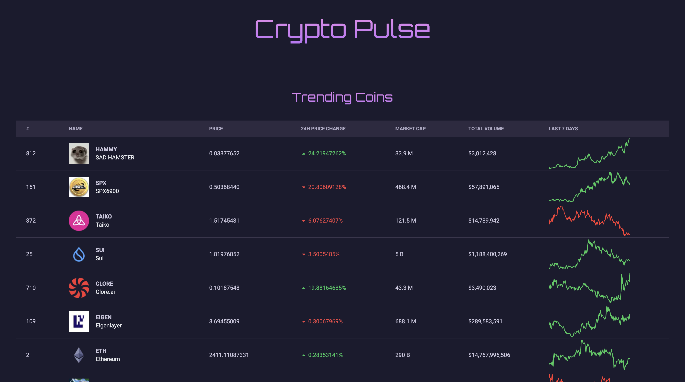
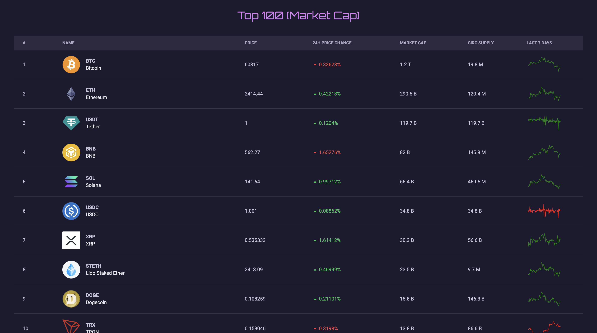

# Crypto Pulse

Welcome to Crypto Pulse! This project provides real-time insights into the cryptocurrency market by displaying trending coins and their respective market capitalizations. Stay updated on the latest movements and discover potential investment opportunities.




## Features

- **Trending Coins**: View the top trending cryptocurrencies based on recent market activity.
- **Market Cap Ranking**: Check the coins sorted by market capitalization to identify major players in the market..
- **Real-Time Data**: Access live updates to ensure you have the most current information..
- **User-Friendly Interface**: Intuitive design for eady navigation and data interpretation.

## Demo

[https://crypto-pulse-five.vercel.app](#)

## Installation

Clone the repository:

```bash
git clone https://github.com/piyush-rawat/crypto-pulse.git
```

Navigate to the project directory

```bash
cd crypto-pulse
```

Install the dependencies

```bash
npm install
```

Run the project

```bash
npm run dev
```

## Usage

1. **View Trending Coins**: Navigate to the "Trending" section to see which coins are currently gaining popularity.
2. **Explaore Market Cap**: Access the "Market Cap" section to view and compare cryptocurrencies by their market capitalizations.

## Technologies Used

- Next.js
- Tailwindcss
- APIs: CoinGecko
